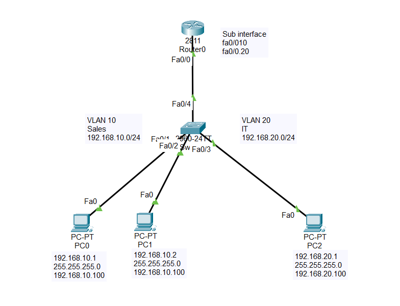

# Router-on-a-Stick – VLAN Trunking Lab (Cisco Packet Tracer)

This lab demonstrates how to implement **Router-on-a-Stick** using a single physical router interface to route traffic between multiple VLANs. The setup includes VLAN creation, trunking, and router subinterface configuration in Cisco Packet Tracer.

---

## 📘 Objectives:
- Create VLAN 10 (Sales) and VLAN 20 (IT)
- Configure trunking between switch and router
- Assign PCs to VLANs with static IPs and gateways
- Use router subinterfaces to enable Inter-VLAN Routing
- Verify connectivity between devices in different VLANs

---

## 🧱 Topology:
- **1 x Router (1841 or similar)**  
- **1 x Layer 2 Switch (2960)**  
- **2 x PCs** (assigned to different VLANs)

---

## 💻 IP Configuration:
- VLAN 10: `192.168.10.0/24`  
- VLAN 20: `192.168.20.0/24`  
- PC0: `192.168.10.1` → Gateway: `192.168.10.100`  
- PC1: `192.168.20.1` → Gateway: `192.168.20.100`  

---

## 📂 Files Included:
- `Router-on-a-Stick.pkt` – Cisco Packet Tracer lab file  
- `Router-on-a-Stick.png` – Network topology diagram  
- `config.txt` – CLI configuration commands 

---

## 📷 Network Diagram:

---

## 🔗 Author
**Noor Anik**  
[LinkedIn Profile](https://www.linkedin.com/in/noor-hossain-anik)  
📧 noorhanik@outlook.com

---

> ✅ More Cisco labs and hands-on projects are available on my GitHub profile.

